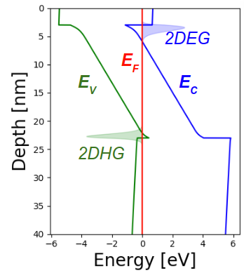

# PyNitride

PyNitride is a 1D solver for band diagram analysis of epitaxial heterostructures, and is capable of arbitrarily mixed self-consistent simulations of classical, Schrodinger, and Multi-band k.p properties, as well as phonon spectra. It can be run on a laptop for simple jobs, and parallelizes well onto many-core machines for computationally intense applications such as the study of hole-phonon interaction.

[More info and full documentation is here!](https://samueljamesbader.github.io/PyNitride/html/manual/index.html)

As it becomes more stable, PyNitride will be added to PyPi, but for the moment, the main way to use it is building from source, as described on the [Contributing page](https://samueljamesbader.github.io/PyNitride/html/manual/contributing.html#getting-started).
